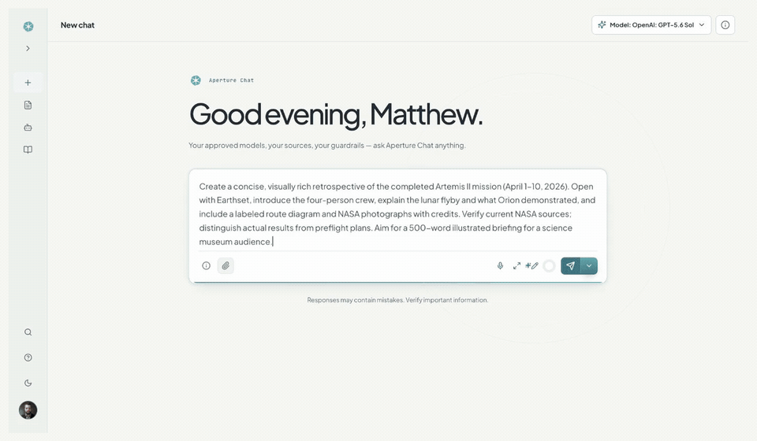
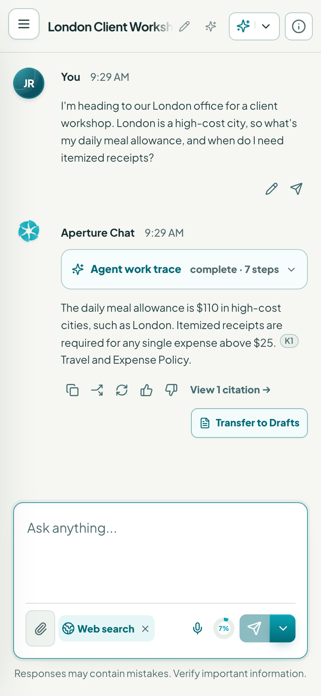
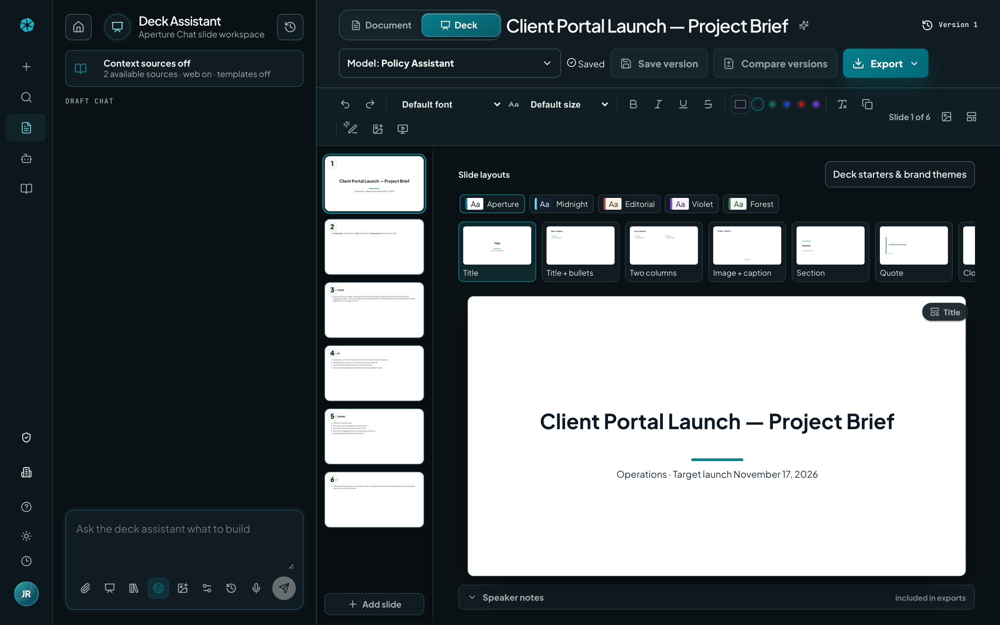
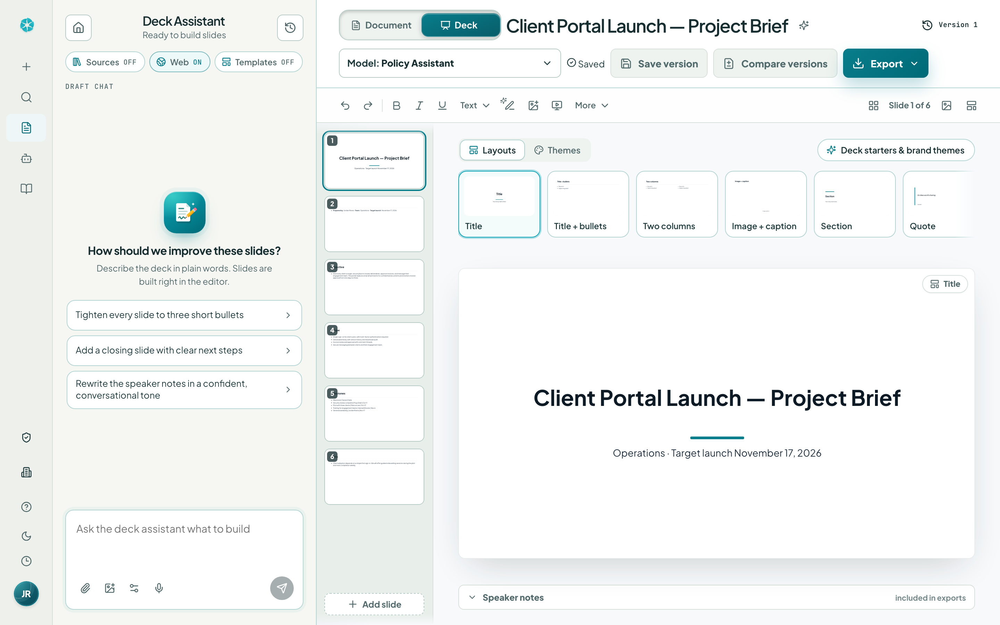
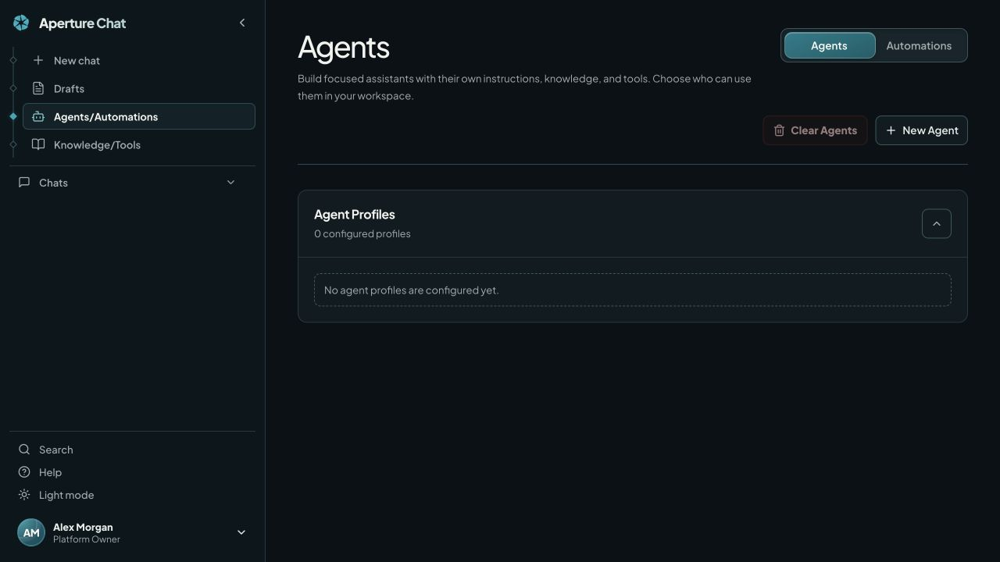
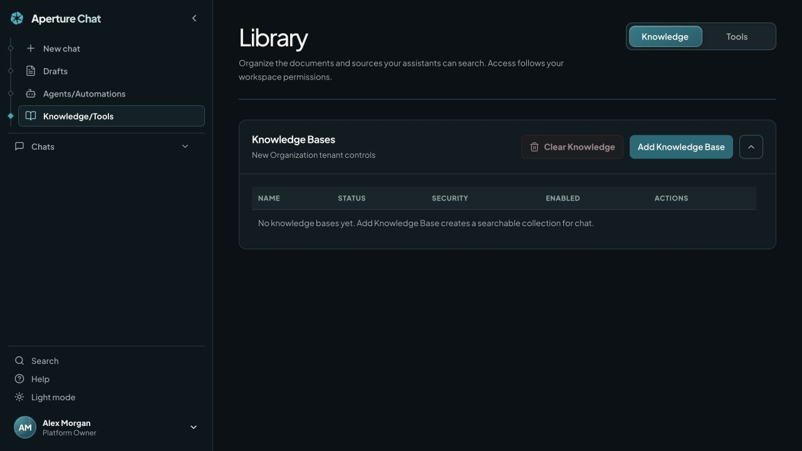
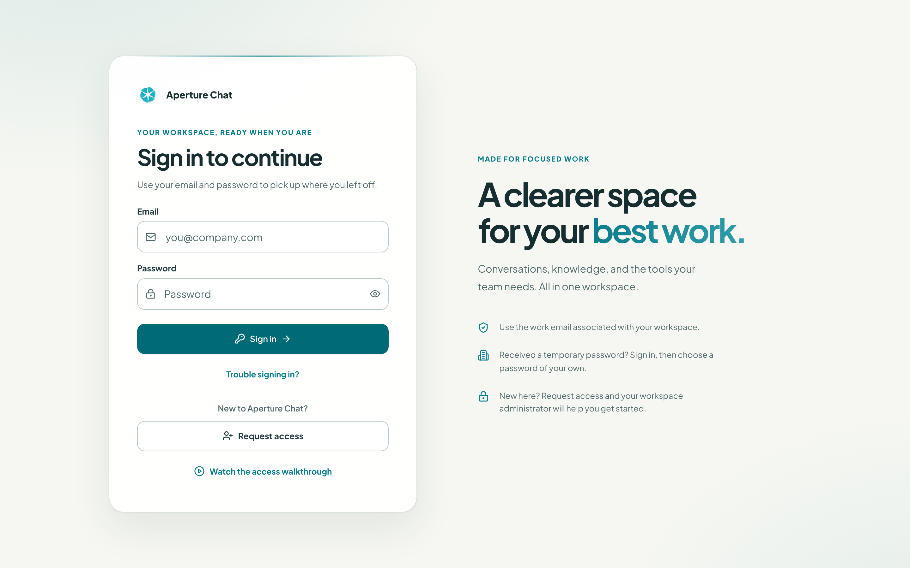

<div align="center">

<a href="https://aperturechat.com/#demoPanel" aria-label="Watch the full Aperture Chat product walkthrough">
<picture>
  <source media="(prefers-reduced-motion: reduce)" srcset="docs/images/product-walkthrough-light.png">
  
</picture>
</a>

<sub><em>The light-mode product walkthrough from ApertureChat.com, using the same six recordings in order. Waiting time is shortened in the original recordings.</em></sub>

**[Watch the full walkthrough with playback controls and fullscreen](https://aperturechat.com/#demoPanel)**

<br><br>

**A self-hosted AI workspace for your organization** — chat, documents, slide decks,
agents, knowledge, and administration on infrastructure you control.


[Platform](#the-platform) · [Install](#installation) · [First steps](#first-steps) · [Updates](#updates-and-branch-images) · [Development](#development) · [Documentation](#documentation) · [License](#license)

</div>

## Why Aperture Chat

Aperture Chat brings approved AI models and shared context into one role-aware
workspace. Platform owners configure providers and organization controls;
tenant administrators manage their teams; users work with the models, sources,
and tools assigned to them.

Application data and encrypted provider credentials are stored in your deployment.
Requests to configured model providers, cloud connectors, and web search services
leave that deployment as those features are used. Choose providers and access
policies appropriate for your organization's data.

The current published release is [v0.5.0](https://github.com/Aperture-Chat/Aperture-Chat/releases/tag/v0.5.0).
It includes compact document formatting, MLA layout improvements, draft-history
previews and archiving, sliding section switches, mobile layout fixes, and
fullscreen training playback. See the [release notes](docs/DOCKER_RELEASE.md#new-since-v047)
and [all releases](https://github.com/Aperture-Chat/Aperture-Chat/releases).

## The Platform

### Chat

| Light | Dark |
| --- | --- |
|  |  |

The screenshots show a clean installation before a provider is connected.
Configure and enable a model to send messages; no demo provider or fabricated
answer is inserted into a fresh deployment.

- **Approved models:** select an available model for the conversation. Runtime access follows provider, platform, tenant, group/user, and deny policies.
- **Sources and search:** use attachments, workspace knowledge, connected documents, and enabled web search. Inspect the sources returned with an answer.
- **Work traces and session details:** review reported execution steps, context, and provider-reported usage. Availability depends on the provider and operation.
- **Response actions:** copy, share, regenerate, give feedback, and transfer an answer to Drafts.
- **History:** search conversations and organize them with folders, pins, and archives.
- **Mobile layout:** compact composer controls and a separate row for active tools keep the writing area usable on narrow screens.

<details>
<summary>Mobile chat</summary>
<br>

</details>

### Documents and slide decks

Use the sliding **Document / Deck** switch inside Drafts to choose the format.
Manual editing, import, saving, and export remain available when AI drafting is
unconfigured; generation and conversational edits require an enabled model.

| Document editor | Slide editor |
| --- | --- |
|  |  |

- **Document formatting:** common styles stay visible; Text, Paragraph, More, and Insert menus group the remaining controls. Use the ruler, lists, links, tables, and page layout tools as needed.
- **Drafting context:** choose templates, upload a Word template, attach files, select knowledge, and control web search from the assistant rail. Check which context sources are enabled before generating.
- **Revisions and history:** save versions, compare revisions, restore a draft, preview history entries, archive/unarchive drafts, or delete entries you no longer need. Check the server-save indicator before leaving; entries marked **Local only** (including deck snapshots) remain browser-local, so export a copy before moving devices.
- **Academic documents:** MLA-aware rendering includes double spacing, first-line indents, and reference formatting. Review the student heading, citations, and exported layout against the assignment requirements.
- **Slide authoring:** convert a document into slides or start a blank deck; edit text, add and rearrange slides, choose layouts and backgrounds, and write speaker notes. Import a PowerPoint brand template or use configured AI slide/image tools.
- **Export:** download Word (`.docx`), Markdown (`.md`), or PowerPoint (`.pptx`) as appropriate to the format; use the document print/PDF flow for a paginated copy.

<details>
<summary>Document dark mode and slide light mode</summary>

| Document — dark | Deck — light |
| --- | --- |
|  |  |

</details>

### Agents, automations, knowledge, and tools

| Agents / Automations | Knowledge / Tools |
| --- | --- |
|  |  |

- **Agents:** reusable profiles with instructions, models, knowledge, and tool access.
- **Automations:** run multi-step workflows immediately or on enabled one-time, weekly, or cron schedules. Inspect status and transcripts; schedules run inside the API process.
- **Knowledge:** upload documents to a searchable collection and retrieve relevant passages with citations. OCR and dense embeddings run locally when enabled; media transcription uses a configured model provider.
- **Cloud sources:** connect Google Drive, Box, SharePoint, OneDrive, or iManage with the provider's required credentials and permissions. Configuration and a successful connection check do not automatically grant every user access to every document.
- **Tools:** manage reusable prompts, skills, and MCP connections. Tool availability remains subject to workspace policy and connector configuration.

### Identity and administration

| Role | Responsibilities |
| --- | --- |
| **Platform Owner** | Providers and credentials, organization-wide model availability, shared connector controls, organizations, branding, platform audit, and release updates. |
| **Tenant Admin** | Tenant users, groups, access requests, SSO, model restrictions, knowledge, tools, policies, and tenant analytics. |
| **User** | Granted chat, drafting, agent, knowledge, and tool workflows. |

OIDC sign-in supports Entra ID, Google Workspace, Okta, and custom configuration.
SCIM 2.0 provisioning requires its configured bearer token. Local accounts
support temporary-password rotation, authenticator setup, and recovery flows.
Signed sessions are required in deployed environments. Tenant administrators'
prompt activity is scoped to the users they administer; owner prompts are not
made visible simply because someone can open the admin console.

Provider and connector secrets are encrypted at rest and masked in ordinary UI
and API payloads. Credential management and explicit reveal operations require
platform-owner authorization. Administrative actions and supported chat activity
feed audit and analytics views, with CSV exports.

Role-specific Help includes narrated walkthroughs and downloadable guides.
Training playback offers fullscreen controls and a landscape presentation on
mobile, with a fallback where native fullscreen is unavailable.

## Installation

### Run a published release locally

Requires Docker Engine with Compose v2. Download and extract the Docker bundle
from a [reviewed release](https://github.com/Aperture-Chat/Aperture-Chat/releases),
then open a terminal in the extracted directory:

```bash
cp .env.example .env
# Edit .env before continuing:
# APERTURE_IMAGE_TAG=v0.5.0
# APERTURE_SECRET_KEY=<a unique, high-entropy secret of at least 32 characters>
docker compose -f docker-compose.release.yml --profile local pull
docker compose -f docker-compose.release.yml --profile local up -d
docker compose -f docker-compose.release.yml --profile local ps
```

Use the tag belonging to your downloaded bundle. Open `http://localhost:5173`.
A fresh data volume has no seeded owner, demo users, or provider catalog: create
the first platform owner, then configure the installation.

Both source and release Compose stacks enforce production authentication and
secret requirements, including with the `local` profile. The local profile
binds API/web ports to loopback by default. It does not enable development auth.

### Install on a VPS with HTTPS

With Docker Compose, Python 3, a DNS hostname, and ports 80/443 available, run the
installer from a reviewed release bundle containing `scripts/install-release.py`:

```bash
python3 scripts/install-release.py --directory ./deployment --domain chat.example.com --tag v0.5.0 --start
```

Replace the domain and version. The installer creates private configuration,
a strong secret, and a stable Compose project identity; it refuses to overwrite
an existing installation directory. Complete first-owner setup immediately.
Omit `--start` to inspect the generated configuration before starting Docker.
See [Docker deployment](docs/DOCKER_RELEASE.md) for manual HTTPS setup, forks,
private registries, and upgrades of existing installations.

## First steps

1. Create the first owner account and store its credentials securely.
2. Open the Platform Owner Console, add a provider, and validate its connection.
3. Sync its model catalog and enable the models the organization should use.
4. Configure tenant users/groups and model grants; approve access requests as appropriate.
5. Add knowledge, connectors, and tools deliberately, then verify access as an ordinary user.
6. Send a real test message and check the response, sources, and relevant audit records.

New users can request access from the sign-in screen. The access-and-sign-in
walkthrough is available there before login. Approved users receiving a
temporary password must choose their own password when prompted.



## Updates and branch images

Stable releases publish API and web images under
`ghcr.io/aperture-chat/aperture-chat-api` and
`ghcr.io/aperture-chat/aperture-chat-web`, for `linux/amd64` and `linux/arm64`.

| Tag | Use |
| --- | --- |
| `v0.5.0` | Reviewed stable release. Prefer a specific version for deployment. |
| `latest` | Moving stable-release alias. |
| `dev`, `test`, `main` | Moving image pairs for the corresponding release branch. |
| `v0.5.0-dev`, `v0.5.0-test`, `v0.5.0-main` | Moving branch aliases for commits carrying that version. |
| `<branch>-<full-commit-sha>` | Commit-addressed builds; record manifest digests for exact reproducibility across rebuilds. |

Promotion follows **dev → test → main**. Both test images must be inspectable
before main promotion. Stable publication promotes those inspected manifests
without rebuilding. Verify both API and web digests, not only the presence of a tag.

The release stack includes an owner-controlled updater sidecar. It pulls the
new image pair, recreates API/web, verifies health and version, and attempts
rollback on failure. The sidecar has Docker-socket access and therefore host-level
control. Existing/source-build deployments need the appropriate manual setup;
a version notice alone does not install the updater.

Back up persistent data and private configuration before upgrading. Preserve
Compose project identity, volume names, and the signing secret. Never use
`docker compose down -v` for a normal upgrade. See the
[upgrade procedure](docs/DOCKER_RELEASE.md#upgrade) for migrations, recovery,
and manual updates.

## Architecture and persistence

| Path | Purpose |
| --- | --- |
| `apps/web` | React 19, TypeScript, Vite, and Vitest; product UI and training media. |
| `services/api` | FastAPI, model routing, identity, policy, persistence, retrieval, and workflow execution. |
| `services/api/app/db` | SQLAlchemy models, Alembic integration, and explicit import/transfer utilities. |
| `infra/caddy` | Reverse proxy and HTTPS configuration. |
| `infra/updater` | Release updater sidecar. |
| `docs` | Deployment, architecture, product images, and role guides. |

Application persistence spans SQL-backed state (SQLite by default), remaining
JSON state, and dedicated local stores such as the knowledge vector index.
An optional PostgreSQL Compose profile requires an explicit, verified migration
and `APERTURE_DATABASE_URL`; enabling the profile alone does not switch storage.
Back up the full configured data set and secret, not just `runtime_state.json`.

The scheduler and some stores remain process-local. PostgreSQL does not by
itself make multiple API replicas safe. See [architecture](docs/architecture.md)
for the current boundaries. Outbound protections block metadata/link-local
access and restrict private-network destinations; operators explicitly allow
required internal hosts rather than disabling those protections.

## Development

Requirements: Node.js 24+ (use `.nvmrc`), npm, and Python 3.12+.

From the repository root:

```bash
cp .env.example .env
npm ci
python3 -m venv services/api/.venv
services/api/.venv/bin/python -m pip install -e './services/api[dev]'
```

Run these in separate terminals:

```bash
npm run dev:web
```

```bash
cd services/api
.venv/bin/uvicorn app.main:app --reload --host 127.0.0.1 --port 8000
```

The API loads the root `.env`; the Vite server proxies API requests to port 8000.
A clean local instance can create its first owner without a provider key. Add
and enable a provider/model before testing generation. Local-only development
can generate a persisted signing secret when the configured secret is blank;
deployed Compose stacks require an explicit strong secret.

For source-built containers, configure `.env` (including the secret), then run:

```bash
docker compose --profile local up -d --build
```

Checks before submitting changes:

```bash
git diff --check
npm --workspace apps/web run typecheck
npm --workspace apps/web run test -- --run
npm run build:web
cd services/api && .venv/bin/python -m pytest -q
```

## Contributing

Read [CONTRIBUTING.md](CONTRIBUTING.md). External contributors work from a fork
and open PRs to `dev`; organization contributors start from `dev`. Keep changes
focused, preserve unrelated work, and provide validation and screenshots for
visible changes. Promotion uses merge commits through `dev`, `test`, and `main`.

Never commit populated environment files, credentials, runtime databases,
production logs, or private deployment details. Screenshots and examples must
use synthetic data. Report vulnerabilities through [SECURITY.md](SECURITY.md).
Participation follows [CODE_OF_CONDUCT.md](CODE_OF_CONDUCT.md).

## Documentation

- [Documentation index](docs/INDEX.md) — reader paths and repository map.
- [Docker deployment and release notes](docs/DOCKER_RELEASE.md) — installation, image tags, updates, health checks, and recovery.
- [Architecture](docs/architecture.md) — services, access boundaries, persistence, and integrations.
- [User guide (PDF)](docs/aperture-user-guide.pdf) — chat, sources, drafts, and account help.
- [Administrator guide (PDF)](docs/aperture-admin-guide.pdf) — access, groups, policies, retention, and issue review.
- [Platform owner guide (PDF)](docs/aperture-owner-guide.pdf) — providers, organization controls, and operations.
- [Training publication](docs/TRAINING.md) — lesson sources and media regeneration.
- [README image maintenance](docs/images/README.md) — capture provenance and tour regeneration.

## License

Aperture Chat is source-available under the [Aperture Chat Community Source
License](LICENSE.md). Anyone may use, copy, modify, and share the platform at
no license fee, subject to its terms. Selling, paid licensing, paid access to,
and other commercialization of the application layer are not allowed. Selling
or reselling bona fide AI-model usage tokens or credits through the platform,
including with a markup, is expressly allowed.

Public forks must retain [LICENSE.md](LICENSE.md) and [NOTICE.md](NOTICE.md),
and clearly state in both their root license notice and top-level README that
they are a fork of Aperture Chat. No Aperture Chat branding or attribution is
required inside a forked application; forks may use their own product name and
visual identity.
