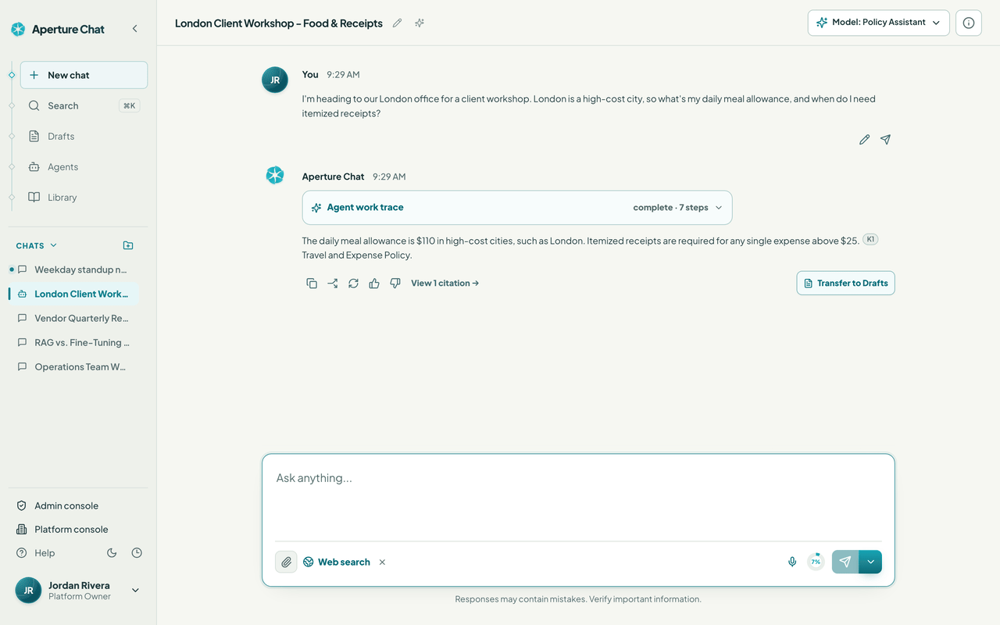
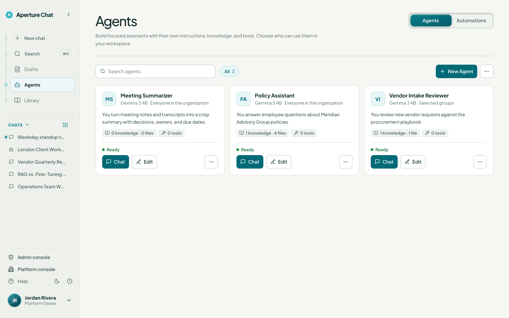
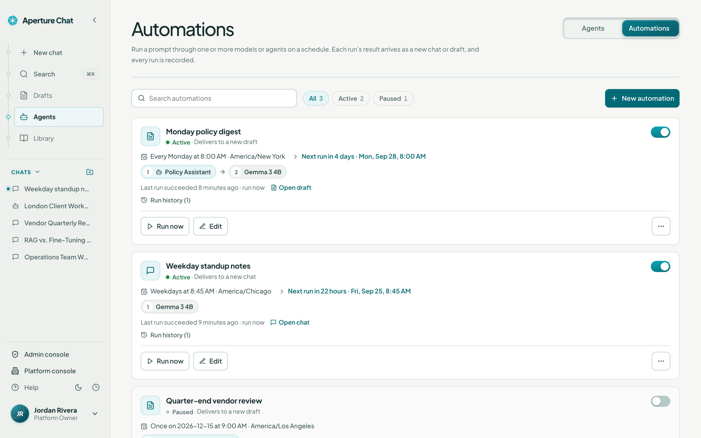
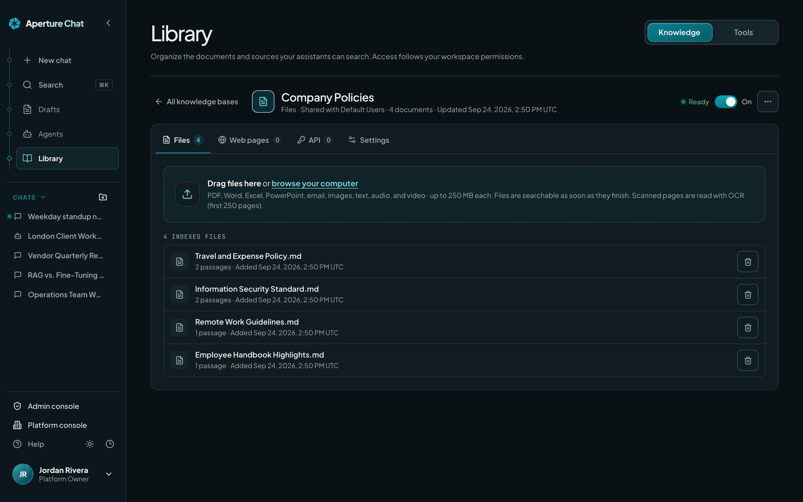
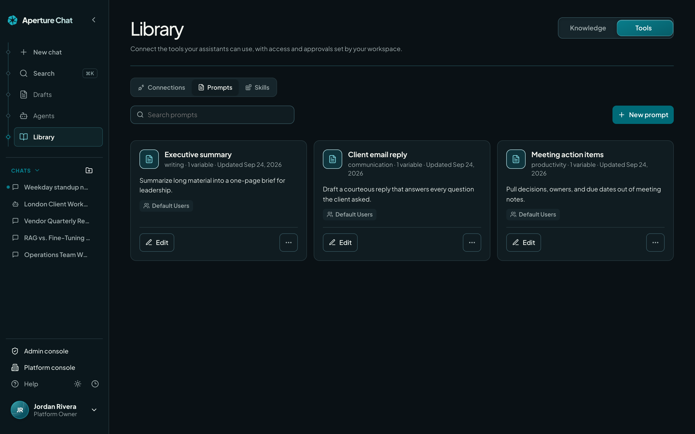
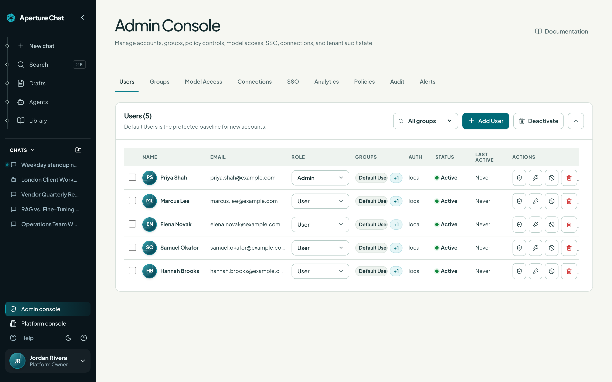
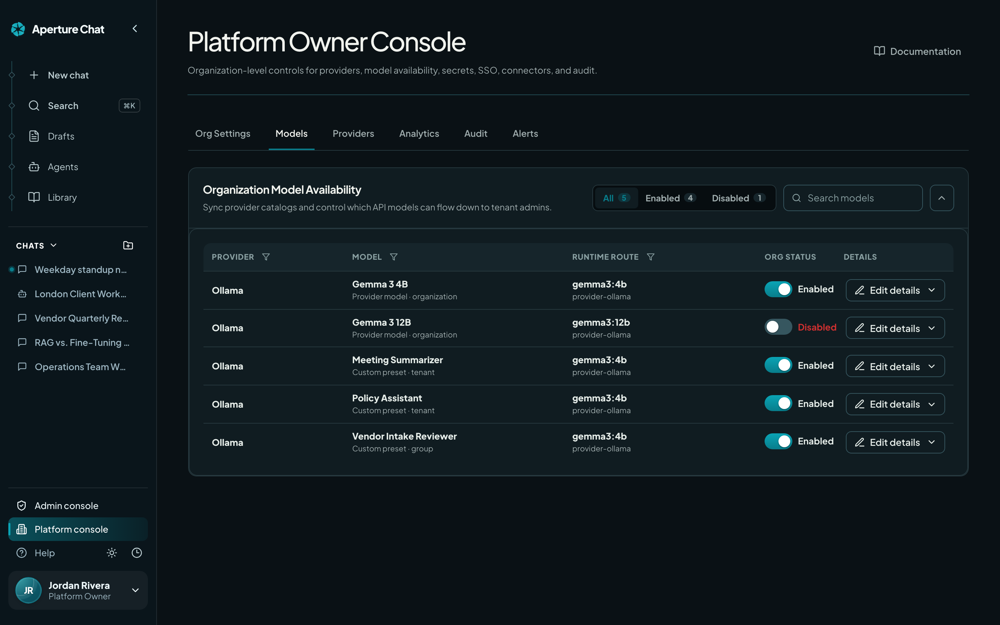

<div align="center">


# Aperture Chat

**The self-hosted AI workspace for your organization.**<br>
Chat, documents, slide decks, agents, automations, and knowledge, on infrastructure you control.

[](https://github.com/Aperture-Chat/Aperture-Chat/releases)
[](LICENSE.md)


[Features](#features) · [Get started](#get-started) · [Updates](#updates-and-images) · [Architecture](#architecture) · [Development](#development) · [Documentation](#documentation) · [License](#license)

<br>

<picture>
  <source media="(prefers-reduced-motion: reduce)" srcset="docs/images/product-tour-light.png">
  
</picture>

<sub>The current interface in a synthetic organization, answered by an open model running locally through Ollama.
Watch the narrated walkthrough at <a href="https://aperturechat.com/#demoPanel">ApertureChat.com</a>.</sub>

</div>

## Why Aperture Chat

<table>
<tr>
<td width="33%" valign="top">

**Your infrastructure**<br>
Run the whole workspace with Docker Compose. Application data and encrypted
provider credentials stay in your deployment.

</td>
<td width="33%" valign="top">

**Any approved model**<br>
Connect OpenAI, Anthropic, Azure OpenAI, Google Gemini, OpenRouter, Ollama,
and other OpenAI-compatible providers, then decide who may use each model.

</td>
<td width="33%" valign="top">

**Built-in governance**<br>
Role-aware consoles, SSO and SCIM, group policies, audit trails, retention,
and analytics for the people responsible for AI use.

</td>
</tr>
</table>

Platform owners configure providers and organization-wide controls; tenant
administrators manage their people, groups, and sources; users work with the
models, knowledge, and tools assigned to them.

Requests to configured model providers, cloud connectors, and web search leave
your deployment when those features are used. Choose providers and access
policies appropriate for your organization's data.

> **Current release: [v0.5.6](https://github.com/Aperture-Chat/Aperture-Chat/releases/tag/v0.5.6)**:
> a simpler, more polished sign-in screen with a clear Request access button
> for new users, and a longer access walkthrough that starts on the sign-in
> page. Aperture Chat is now MIT licensed.
> See the [release notes](docs/DOCKER_RELEASE.md#new-since-v055) and
> [all releases](https://github.com/Aperture-Chat/Aperture-Chat/releases).

## Features

### Chat

| Light | Dark |
| --- | --- |
|  |  |

- **Approved models and agents.** Pick a model or agent for each conversation. Access follows provider, platform, tenant, group, user, and deny policies.
- **Grounded answers.** Use attachments, knowledge bases, connected documents, and web search, then open the citations behind an answer.
- **Work traces.** Review the steps, sources, and provider-reported usage behind each reply. Availability depends on the provider.
- **Response actions.** Copy, share, regenerate, rate, and transfer an answer to Drafts.
- **Organized history.** Search conversations and keep them tidy with folders, pins, and archives. Read state follows your account across browsers.

<details>
<summary><b>Mobile layout</b></summary>
<br>

</details>

### Documents and slide decks

| Document editor | Slide editor |
| --- | --- |
|  |  |

- **One workspace, two formats.** Switch between **Document** and **Deck** in Drafts. Manual editing, import, saving, and export work even before AI drafting is configured.
- **Drafting context.** Choose templates, upload a Word template, attach files, select knowledge, and control web search from the assistant rail.
- **Edit with AI.** Select text and choose **Ask AI**, or rework a whole slide with **Edit slide with AI**. Every suggestion is reviewed before it replaces anything.
- **Editor tools.** A `/` command menu, Markdown shortcuts, find and replace, a heading outline, zoom, table and picture tools, and, for decks, layouts and themes, a slide sorter, snapping guides, and presenter view.
- **Versions you can trust.** Save versions, compare and restore revisions, preview history, and archive drafts. Entries marked **Local only** stay in the browser, so export a copy before switching devices.
- **Academic formatting.** MLA-aware layout with double spacing, first-line indents, and reference formatting.
- **Export.** Download Word (`.docx`), Markdown (`.md`), or PowerPoint (`.pptx`), or print a paginated PDF.

<details>
<summary><b>Document in dark mode, deck in light mode</b></summary>
<br>

| Document, dark | Deck, light |
| --- | --- |
|  |  |

</details>

### Agents and automations

| Agents | Automations |
| --- | --- |
|  |  |

- **Agents** bundle instructions, a model, knowledge, tools, prompts, and skills into a reusable assistant. Choose who can use each one, check its readiness, and start from a template or duplicate an existing agent.
- **Automations** run a prompt through one or more models or agents, once, weekly, or on a cron schedule in the time zone you choose. A live preview lists the next runs, and invalid schedules are rejected before they are saved.
- **Delivered where you work.** Each run arrives as a new chat or a new draft, and the last 10 runs, including **Run now**, are kept in the run history. Scheduled automations pause after three failures in a row.

### Library: knowledge and tools

| Knowledge | Tools |
| --- | --- |
|  |  |

- **Knowledge bases** combine uploaded files, web pages, and API sources. Uploads are keyword-searchable as soon as their text is extracted, and semantic vectors are added in the background. OCR and embeddings run locally; media transcription uses a configured provider.
- **Sync** re-fetches web pages and API sources and never touches uploaded files. API requests pass the outbound guards and refuse redirects.
- **Cloud sources.** Connect Google Drive, Box, SharePoint, OneDrive, or iManage with the provider's credentials and permissions. A successful connection does not grant every user access to every document.
- **Tools** hold MCP connections, prompt templates, and skills. Connections are tested before they are saved, and tool use remains subject to workspace policy.

### Administration and identity

| Admin Console | Platform Owner Console |
| --- | --- |
|  |  |

| Role | Responsibilities |
| --- | --- |
| **Platform Owner** | Providers and credentials, organization-wide model availability, shared connectors, organizations, branding, platform audit, and release updates. |
| **Tenant Admin** | Users, groups, access requests, SSO, model restrictions, knowledge, tools, policies, retention, and tenant analytics. |
| **User** | Granted chat, drafting, agent, knowledge, and tool workflows. |

- **Sign-in.** OIDC with Entra ID, Google Workspace, Okta, or a custom provider; SCIM 2.0 provisioning with its bearer token; local accounts with temporary-password rotation, authenticator setup, and recovery.
- **Secrets.** Provider and connector secrets are encrypted at rest and masked in the UI and API. Managing or revealing them requires platform-owner authorization.
- **Oversight.** Administrative actions and chat activity feed audit and analytics views with CSV export. Tenant administrators see prompt activity only for the users they administer.
- **Training.** Role-specific Help includes narrated walkthroughs and downloadable guides, with fullscreen playback on desktop and mobile.

## Get started

### Run a published release locally

Requires Docker Engine with Compose v2. Download and extract the Docker bundle
from a [reviewed release](https://github.com/Aperture-Chat/Aperture-Chat/releases),
then open a terminal in the extracted directory:

```bash
cp .env.example .env
# Edit .env before continuing:
#   APERTURE_IMAGE_TAG=v0.5.6
#   APERTURE_SECRET_KEY=<a unique, high-entropy secret of at least 32 characters>
docker compose -f docker-compose.release.yml --profile local pull
docker compose -f docker-compose.release.yml --profile local up -d
docker compose -f docker-compose.release.yml --profile local ps
```

Use the tag that matches your bundle, then open `http://localhost:5173`. A fresh
data volume has no seeded owner, demo users, or provider catalog: create the
first platform owner, then configure the installation.

Both the source and release Compose stacks enforce production authentication
and secret requirements, including with the `local` profile. The local profile
binds the API and web ports to loopback and does not enable development auth.

### Install on a VPS with HTTPS

With Docker Compose, Python 3, a DNS hostname, and ports 80/443 available, run
the installer from a reviewed release bundle:

```bash
python3 scripts/install-release.py --directory ./deployment --domain chat.example.com --tag v0.5.6 --start
```

Replace the domain and version. The installer writes private configuration, a
strong secret, and a stable Compose project identity, and it refuses to
overwrite an existing installation. Omit `--start` to review the configuration
before Docker starts, and complete first-owner setup immediately afterwards.
See [Docker deployment](docs/DOCKER_RELEASE.md) for manual HTTPS setup, forks,
private registries, and upgrades.

### First steps

1. Create the first owner account and store its credentials securely.
2. In the Platform Owner Console, add a provider and validate the connection.
3. Sync its model catalog and enable the models your organization should use.
4. Set up users and groups, grant models, and review access requests.
5. Add knowledge, connectors, agents, and tools deliberately, then check access as an ordinary user.
6. Send a real test message and check the response, sources, and audit records.

New users can request access from the sign-in screen, which also offers a
pre-login walkthrough. Users who receive a temporary password choose their own
when prompted.

<p align="center">
  
</p>

## Updates and images

Every release publishes multi-architecture (`linux/amd64`, `linux/arm64`) images
to `ghcr.io/aperture-chat/aperture-chat-api` and
`ghcr.io/aperture-chat/aperture-chat-web`.

| Tag | Use |
| --- | --- |
| `v0.5.6` | Reviewed stable release. Prefer a specific version for deployments. |
| `latest` | Moving alias for the newest stable release. |
| `dev`, `test`, `main` | Moving image pairs for each release branch. |
| `v0.5.6-dev`, `v0.5.6-test`, `v0.5.6-main` | Moving branch aliases for commits carrying that version. |
| `<branch>-<full-commit-sha>` | Commit-addressed builds. Record manifest digests for exact reproducibility. |

Changes are promoted **dev → test → main**. Both test images must be inspectable
before main is promoted, and a stable release reuses those inspected manifests
without rebuilding. Verify both the API and web digests, not just the tags.

The release stack includes an owner-controlled updater sidecar that pulls the
new image pair, recreates the API and web services, verifies health and version,
and attempts a rollback on failure. It has Docker-socket access and therefore
host-level control. Existing and source-built deployments need the manual setup
described in the deployment guide; a version notice alone does not install it.

Back up persistent data and private configuration before upgrading, and keep
the Compose project name, volume names, and signing secret unchanged. Never use
`docker compose down -v` for an upgrade. See the
[upgrade procedure](docs/DOCKER_RELEASE.md#upgrade) for migrations, recovery,
and manual updates.

## Architecture

| Path | Purpose |
| --- | --- |
| `apps/web` | React 19, TypeScript, Vite, and Vitest: the product UI and training media. |
| `services/api` | FastAPI: model routing, identity, policy, persistence, retrieval, and automation. |
| `services/api/app/db` | SQLAlchemy models, Alembic integration, and explicit import/transfer utilities. |
| `infra/caddy` | Reverse proxy and HTTPS configuration. |
| `infra/updater` | Release updater sidecar. |
| `docs` | Deployment, architecture, product images, and role guides. |

Application data spans SQL-backed state (SQLite by default), remaining JSON
state, and dedicated local stores such as the knowledge vector index. An
optional PostgreSQL Compose profile requires an explicit, verified migration and
`APERTURE_DATABASE_URL`; enabling the profile alone does not switch storage.
Back up the full data set and the secret, not just `runtime_state.json`.

The scheduler and some stores are process-local, so PostgreSQL alone does not
make multiple API replicas safe. Outbound protections block metadata and
link-local destinations and restrict private networks; allow required internal
hosts explicitly rather than disabling the protections. See
[architecture](docs/architecture.md) for details.

## Development

Requirements: Node.js 24+ (see `.nvmrc`), npm, and Python 3.12+.

```bash
cp .env.example .env
npm ci
python3 -m venv services/api/.venv
services/api/.venv/bin/python -m pip install -e './services/api[dev]'
```

Run the web app and the API in separate terminals:

```bash
npm run dev:web
```

```bash
cd services/api
.venv/bin/uvicorn app.main:app --reload --host 127.0.0.1 --port 8000
```

The API loads the root `.env`, and the Vite server proxies API requests to port
8000. A clean local instance can create its first owner without a provider key;
add and enable a model before testing generation. Local development can
generate a persisted signing secret when none is configured, while deployed
Compose stacks require an explicit strong secret.

To run source-built containers, configure `.env` (including the secret) and run:

```bash
docker compose --profile local up -d --build
```

Checks to run before submitting changes:

```bash
git diff --check
npm --workspace apps/web run typecheck
npm --workspace apps/web run test -- --run
npm run build:web
cd services/api && .venv/bin/ruff check . && .venv/bin/python -m pytest -q
```

## Contributing

Read [CONTRIBUTING.md](CONTRIBUTING.md). External contributors work from a fork
and open pull requests to `dev`; organization contributors branch from `dev`.
Keep changes focused, preserve unrelated work, and include validation and
screenshots for visible changes. Promotion uses merge commits through `dev`,
`test`, and `main`.

Never commit populated environment files, credentials, runtime databases,
production logs, or private deployment details. Screenshots and examples must
use synthetic data. Report vulnerabilities through [SECURITY.md](SECURITY.md).
Participation follows the [Code of Conduct](CODE_OF_CONDUCT.md).

## Documentation

| Guide | What it covers |
| --- | --- |
| [Documentation index](docs/INDEX.md) | Reader paths and repository map. |
| [Docker deployment and release notes](docs/DOCKER_RELEASE.md) | Installation, image tags, updates, health checks, and recovery. |
| [Architecture](docs/architecture.md) | Services, access boundaries, persistence, and integrations. |
| [User guide (PDF)](docs/aperture-user-guide.pdf) | Chat, sources, drafts, and account help. |
| [Administrator guide (PDF)](docs/aperture-admin-guide.pdf) | Access, groups, policies, retention, and issue review. |
| [Platform owner guide (PDF)](docs/aperture-owner-guide.pdf) | Providers, organization controls, and operations. |
| [Training publication](docs/TRAINING.md) | Lesson sources and media regeneration. |
| [README image maintenance](docs/images/README.md) | How these screenshots and the tour are captured. |

## License

Aperture Chat is open source under the [MIT License](LICENSE.md). Anyone may
use, copy, modify, merge, publish, distribute, sublicense, and sell the
software, including commercially, provided the copyright and license notice
are included in all copies or substantial portions of it. The software is
provided as-is, without warranty.
