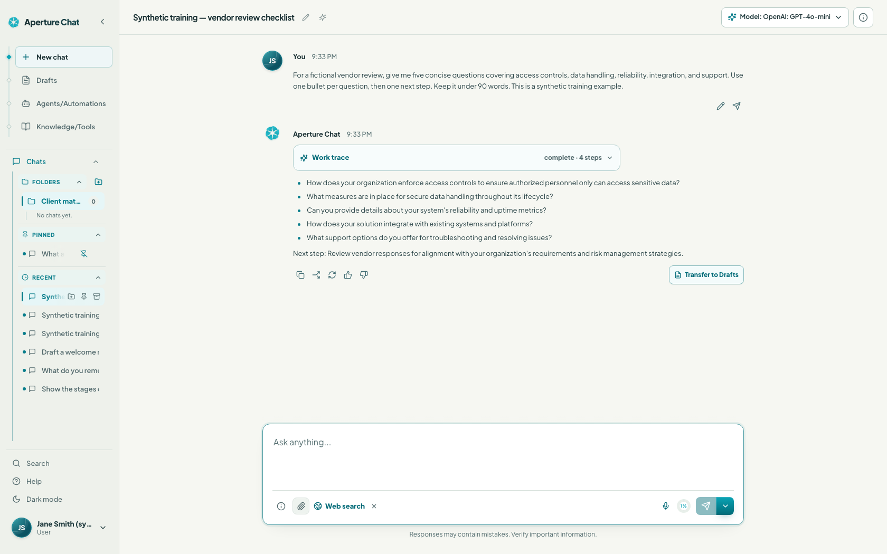
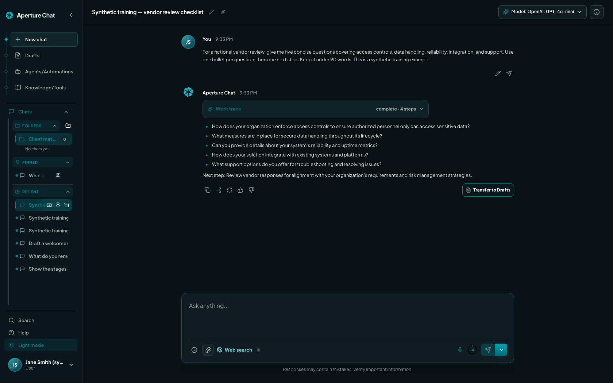
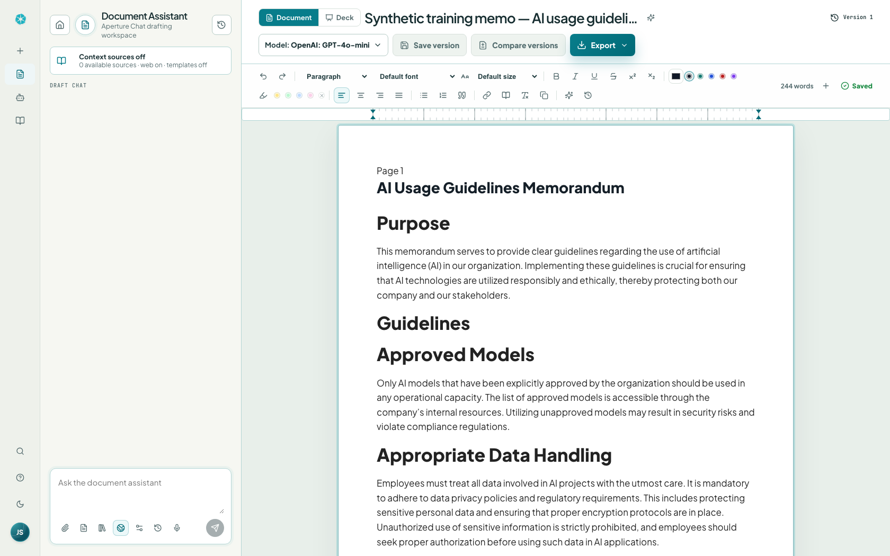
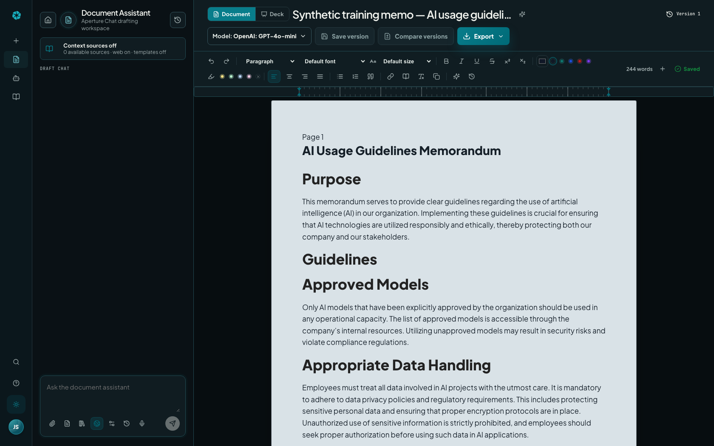

<div align="center">



<sub><em>Current Aperture Chat product screens in light and dark mode, animated as one self-contained SVG from the live deployment.</em></sub>

<br><br>

**The governed, self-hosted AI workspace for the enterprise** — chat, document drafting, agents,
knowledge retrieval, connectors, and full administrative control in a single platform your
organization runs on its own infrastructure.

<br>


[Why Aperture Chat](#why-aperture-chat) · [The Platform](#the-platform) · [Architecture](#architecture) · [Installation](#installation) · [Development](#development) · [Contributing](#contributing) · [Documentation](#documentation) · [License](#license)

</div>

---

## Why Aperture Chat

Aperture Chat is built for businesses that want the productivity of modern AI models without
giving up control: every provider key, access policy, audit record, and piece of workspace data
stays inside your deployment. It serves teams across the enterprise — operations, finance, sales,
HR, legal, consulting — with role-based governance designed for organizations in regulated and
security-conscious industries.

One principle runs through the whole product: **operational truth**. Features either really work
or clearly say they aren't configured. There are no fabricated statuses, no placeholder "success"
states, no controls that pretend. Errors surface as real errors, and numbers the platform can't
verify are labeled as such.

| The workspace | The controls |
| --- | --- |
| **Chat** — governed conversations over the models you approve, with built-in web search, real citations, and a per-response work trace. | **Roles** — platform owners, tenant admins, and users each get an honest, separate surface. |
| **Drafts** — a document assistant with a real editor: describe the document, watch it drafted, revise it conversationally or by hand. | **Model policy** — `provider ∧ platform_allow ∧ grant ∧ ¬deny`, enforced at runtime. |
| **Agents** — reusable assistants that bundle a model, instructions, and knowledge sources. | **Key vault** — provider keys masked everywhere; reveal, rotate, and delete are owner-only actions. |
| **Knowledge** — tenant knowledge bases with vector retrieval and in-chat citations. | **Identity** — OIDC SSO (Entra ID, Google Workspace, Okta, custom), SCIM 2.0 provisioning, managed passwords. |
| **Automations** — scheduled, multi-step model chains with honest run status and full transcripts. | **Audit** — administrative and chat-governance actions, analytics dashboards, CSV exports. |
| **Connectors** — Google Drive, Box, SharePoint, OneDrive, iManage, plus MCP tools with health checks. | **Security posture** — fail-closed startup, egress guard, and no fake success states anywhere. |

## The Platform

### Chat

A full conversational workspace over the models you approve — with built-in web search,
citations, and complete transparency into what the assistant did on every reply.

| Light | Dark |
| --- | --- |
|  |  |

- **Any approved model, per chat.** Switch models mid-conversation from the session header. Providers are configured centrally; users only ever see what governance allows.
- **Web search with real citations.** Built-in public web search grounds answers in current sources — provider-native search where available, and a platform-hosted engine (keyless by default, or your own SearXNG instance) for every other model. Sources appear alongside the response and in the session details panel.
- **Work traces.** Every response carries a collapsible trace of the steps taken — routing, context preparation, retrieval, generation — so users can see exactly how an answer was produced.
- **Session transparency.** Per-chat token usage (as reported by the provider), active tools, and gathered sources are visible in the session panel. Nothing is fabricated: if a provider doesn't report a number, the UI says so.
- **Response controls.** Copy, share, regenerate with inline version history, feedback, prompt resend, and one-click **Transfer to Drafts** to turn an answer into a working document.
- **Organized history.** Folders, pinning, archiving, and full-history search keep long-running work manageable.
- **Attachments and connected sources.** Ground a conversation in uploaded files or documents pulled from connected cloud sources.

### Drafts

A document assistant with a real editor: describe the document you need, watch the work trace as
it's drafted, then revise it conversationally or by hand.

| Light | Dark |
| --- | --- |
|  |  |

- **Full drafting workspace.** Rich-text editor with formatting controls, pagination, versioning, and export — alongside a draft chat rail that shows the assistant's document work trace step by step.
- **Templates and context.** Start from document templates, attach source files, upload a Word template, or pull context from connected cloud sources and workspace knowledge.
- **Conversational revision.** Ask for edits in plain language; the assistant revises the live document rather than pasting text into a chat bubble.
- **Version history.** Save named versions and move between them as a draft evolves.

### Agents, Knowledge, and Automations

- **Agents** — configurable agent profiles that combine a model, instructions, and knowledge sources into reusable assistants.
- **Knowledge** — tenant knowledge bases with document upload and vector retrieval; grounded answers cite their workspace sources directly in chat.
- **Automations** — scheduled, multi-step model chains over chat and drafts, with honest run status and full run transcripts. The in-process scheduler runs enabled one-time, weekly, and cron schedules and records each real run.

### Connectors, Tools, and MCP

- Cloud source connectors for **Google Drive, Box, SharePoint, OneDrive, and iManage**, each with provider-appropriate authentication (OAuth, client credentials, and service accounts) and a real **Test connection** that reports the provider's actual response.
- **MCP tool configuration** with health checks, plus tenant-level governance over which tools are available to whom.
- **Web search administration** — choose the search engine, cap result counts, and enable or disable web access for the whole tenant with one switch.

### Enterprise Identity and Access

- **OIDC single sign-on** with presets for Microsoft Entra ID, Google Workspace, and Okta, plus custom OIDC — including discovery, JWKS validation, just-in-time provisioning, IdP group mapping, and a live *test connection* step so you verify before you enforce.
- **SCIM 2.0** endpoints for automated user provisioning.
- **Local authentication with a managed password lifecycle** — administrators can issue temporary passwords that force rotation at first sign-in.
- **Signed sessions** for every login; browser trust is never based on a bare user identifier in deployed environments.

### Governance and Administration

Three clearly separated roles run the platform:

| Role | Scope |
| --- | --- |
| **Platform Owner** | Providers and API keys, org-wide model catalog and availability, connector switches and credentials, workspace branding, analytics, audit, and release-level controls. |
| **Tenant Admin** | Users, groups, SSO, model restrictions, knowledge bases, tools, MCP settings, response actions, and tenant analytics. |
| **User** | Chats, drafts, agents, knowledge, and tools granted through tenant, group, or individual assignments. |

- **Layered model access policy:** effective runtime access is `provider_connected AND platform_allow AND group_or_user_grant AND NOT explicit_deny`. Platform owners can manage the full synced provider catalog, but chat, agents, and user-facing model selectors only expose models that are actually enabled for runtime use.
- **Provider key vault:** API keys are masked everywhere by default; reveal, rotate, and delete are platform-owner actions, and keys are never serialized into responses, logs, or audit metadata.
- **Audit trail** covering administrative and chat-governance actions, with analytics dashboards and CSV exports.
- **Built-in enablement:** narrated in-app video walkthroughs for each role and downloadable PDF guides for users, admins, and platform owners.

### Security Posture

- **Fail-closed deployment configuration.** Outside local development, the API refuses to start without a unique, high-entropy signing secret, and development conveniences (like header-based auth) are disabled regardless of flags.
- **Egress guard** restricting outbound network access in deployed environments to operator-approved hosts.
- **Honest by design.** Features either really work or clearly say they aren't configured — no fabricated statuses, latencies, or placeholder "success" states. Errors surface as real errors.

## Architecture

| Path | What it is |
| --- | --- |
| `apps/web` | React 19 + TypeScript product UI, built with Vite and tested with Vitest. |
| `services/api` | FastAPI (Python 3.12) backend: auth and sessions, policy enforcement, provider/model gateway, chat, knowledge, connectors, SCIM, tools, agents, and automations (with an in-process scheduler that fires enabled schedules). |
| `infra/caddy`, `docker-compose.yml` | Container deployment: web, API, and reverse proxy. Background work (scheduled automations, Elastic delivery) runs inside the API process. |
| `docs` | Project index, architecture notes, and documentation assets — start at [docs/INDEX.md](docs/INDEX.md). |

The API is provider-agnostic: OpenRouter and any OpenAI-compatible endpoint work through one
model gateway, so a single deployment can route across hundreds of models under one governance
policy.

## Installation

The first Docker release path is compose-based and starts clean by default: no
seeded platform owner, no demo users, and no seeded provider/model catalog. On a
fresh `aperture-api-data` volume, the sign-in screen opens in first-run mode and
the account created there becomes the platform owner.

```bash
cp .env.example .env
# Set APERTURE_SECRET_KEY in .env to a unique, high-entropy value of at least 32 characters.
docker compose -f docker-compose.release.yml --profile local up -d
```

Both compose files force the API into its production security posture and fail
before container startup when `APERTURE_SECRET_KEY` is absent. The API also
rejects public-default or shorter-than-32-character secrets. This applies even
to the `local` Compose profile; use a bare-metal development run when you need
the local-only auto-generated signing secret behavior.

Open `http://localhost:5173`, create the first platform owner, then configure
providers, keys, users, groups, connectors, and SSO from the owner/admin
surfaces. Runtime state is persisted in the `aperture-api-data` Docker volume:
users, password hashes, provider metadata, masked/encrypted secrets, chats,
knowledge metadata, vectors, tools, prompts, automations, audits, and the local
signing secret survive image rebuilds and API restarts.

For source builds, use `docker compose --profile local build`. Before exposing
Caddy publicly, replace the safe `localhost` site address with your DNS name,
set `APERTURE_API_BASE_URL` and `APERTURE_WEB_ORIGINS` in `.env`, then run the
`vps` or `prod` profile. Caddy obtains and renews HTTPS certificates for the
configured public hostname.

The release stack includes an `updater` service. Platform owners can review a
new tagged release and start an update from the sidebar. It pulls both images,
recreates the API and web services, verifies both, and attempts to restore the
previous images if either service fails. Persistent data volumes are retained;
back up application data before an upgrade. Full release details are in
[docs/DOCKER_RELEASE.md](docs/DOCKER_RELEASE.md).

## Development

Requirements: Node.js 24 LTS (see `.nvmrc`) and Python 3.12+.

```bash
# Web
npm install
npm run dev:web                                  # Vite dev server

# API (from services/api, with a virtualenv)
pip install -e ".[dev]"
uvicorn app.main:app --reload --port 8000
```

Copy `.env.example` to `.env` and fill in what you use — at minimum a provider key. Every setting
is documented inline in the example file.

Verification suite:

```bash
npm --workspace apps/web run typecheck
npm --workspace apps/web run test -- --run
npm run build:web
cd services/api && .venv/bin/python -m pytest -q
```

## Contributing

Contributions are welcome through the staged `dev` -> `test` -> `main` flow.
External contributors work from a fork and open pull requests to `dev`;
organization contributors start from `dev`. Changes stay deliberately small,
include clear review notes, and use screenshots or short clips for visible work
when practical. Every `test` commit publishes immutable API and web container
images that must be inspected before promotion to `main`.

Read [CONTRIBUTING.md](CONTRIBUTING.md) before starting and use
[SECURITY.md](SECURITY.md) for private vulnerability reporting. Community
participation is governed by [CODE_OF_CONDUCT.md](CODE_OF_CONDUCT.md).

## Documentation

- [docs/INDEX.md](docs/INDEX.md) — project map and reader paths.
- [docs/architecture.md](docs/architecture.md) — runtime shape, boundaries, and service contracts.
- [CONTRIBUTING.md](CONTRIBUTING.md) — branch flow, review evidence, tests, and container inspection.
- [SECURITY.md](SECURITY.md) — private vulnerability reporting and supported versions.
- [User guide (PDF)](docs/aperture-user-guide.pdf) — sign-in, first steps, chat, sources, drafts, and account help.
- [Administrator guide (PDF)](docs/aperture-admin-guide.pdf) — user guidance plus access approval, groups, policies, retention, and issue review.
- [Platform owner guide (PDF)](docs/aperture-owner-guide.pdf) — administrator guidance plus initial setup, providers, organization controls, and operations.
- [Training publication](docs/TRAINING.md) — lesson inventory, source files, media regeneration, and verification.

## License

Aperture Chat is source-available under the [Aperture Chat Community Source
License](LICENSE.md). Anyone may use, copy, modify, and share the platform at
no license fee, subject to its terms. Selling, paid licensing, paid access to,
and other commercialization of the application layer are not allowed. Selling
or reselling bona fide AI-model usage tokens or credits through the platform,
including with a markup, is expressly allowed.

Public forks must retain [LICENSE.md](LICENSE.md) and [NOTICE.md](NOTICE.md),
and clearly state in both their root license notice and top-level README that
they are a fork of Aperture Chat. No Aperture Chat branding or attribution is
required inside a forked application; forks may use their own product name and
visual identity.
